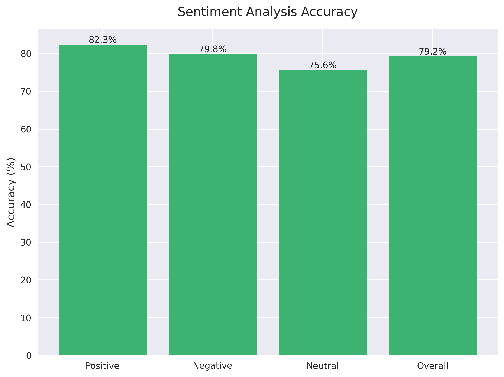
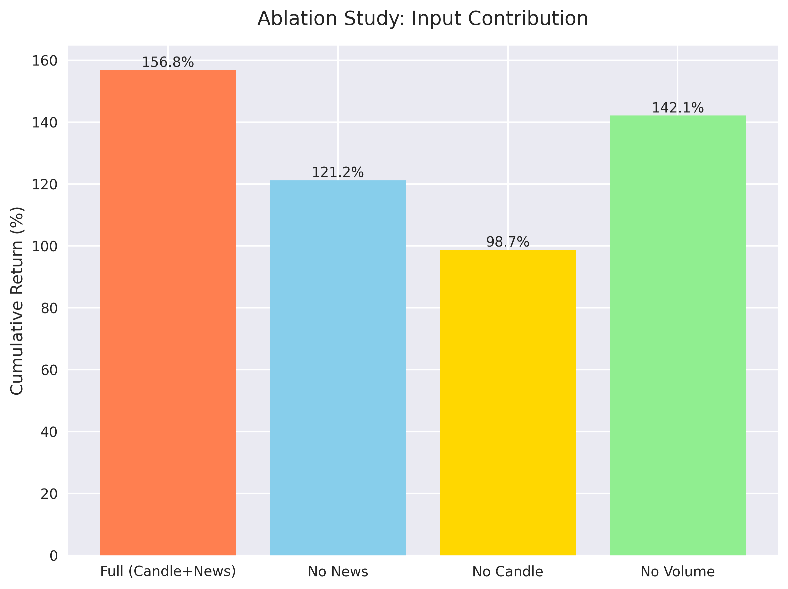

# 시장 레짐 동적 제어 앙상블 트레이딩 시스템

## 프로젝트 구조
```
paper1-2/
├── src/                           # 소스 코드
│   ├── core/                     # 핵심 기능
│   │   ├── market_regime_detector.py        # 시장 레짐 감지기
│   │   ├── regime_adaptive_trading_system.py # 레짐 적응형 트레이딩 시스템
│   │   ├── adaptive_risk_manager.py         # 적응형 리스크 관리자
│   │   ├── multi_timeframe_analyzer.py      # 다중 시간대 분석기
│   │   └── technical_indicators_stack.py    # 기술적 지표 스택
│   │
│   ├── models/                    # 모델 관련
│   │   ├── statistical_models.py           # 통계 모델
│   │   ├── dqn_agent.py                    # DQN 에이전트
│   │   ├── rl_trader.py                    # 강화학습 트레이더
│   │   └── agent_ensemble.py               # 에이전트 앙상블
│   │
│   ├── traders/                   # 트레이딩 관련
│   │   ├── basic_trader.py                 # 기본 트레이더
│   │   ├── advanced_multimodal_trader.py   # 고급 멀티모달 트레이더
│   │   ├── ensemble_trader.py              # 앙상블 트레이더
│   │   └── trading_strategy.py             # 트레이딩 전략
│   │
│   ├── analysis/                  # 분석 도구
│   │   ├── candlestick_analyzer.py         # 캔들스틱 분석기
│   │   ├── sentiment_analyzer.py           # 감성 분석기
│   │   ├── ollama_sentiment_analyzer.py    # 감성 분석기 (Ollama)
│   │   └── deepseek_news_analyzer.py       # 뉴스 분석기
│   │
│   ├── fusion/                    # 데이터 융합
│   │   ├── multimodal_fusion.py            # 멀티모달 융합
│   │   └── feature_fusion.py               # 특징 융합
│   │
│   └── utils/                     # 유틸리티
│       ├── binance_api.py                  # 바이낸스 API
│       └── news_collector.py               # 뉴스 수집기
│
├── scripts/                       # 실행 스크립트
│   ├── run_regime_adaptive_system.py   # 레짐 적응형 시스템 실행
│   ├── run_advanced_multimodal_trader.py # 고급 멀티모달 트레이더 실행
│   ├── backtesting.py                  # 백테스팅
│   ├── run_all.bat                     # Windows 실행 스크립트
│   ├── run_all.sh                      # Linux/Mac 실행 스크립트
│   ├── install.bat                     # Windows 설치 스크립트
│   └── install.sh                      # Linux/Mac 설치 스크립트
│
├── visualization/                 # 시각화 도구
│   ├── generate_performance_graphs.py  # 성능 그래프 생성
│   └── generate_research_graphs.py     # 연구 그래프 생성
│
├── data/                         # 데이터 저장
│   └── .gitkeep
│
├── results/                      # 결과 저장
│   ├── performance/             # 성능 측정 결과
│   ├── rl_models/              # 강화학습 모델 저장
│   └── performance_metrics_for_paper.csv
│
├── docs/                        # 문서
│
├── tradingview/                # 트레이딩뷰 관련
│
├── .github/                    # GitHub 설정
│
├── requirements.txt            # 프로젝트 의존성
├── .gitignore                 # Git 무시 파일
└── README.md                  # 프로젝트 문서
```

## 시스템 아키텍처

### 1. 시장 레짐 감지 시스템
#### 시장 상태를 실시간으로 분석하고 분류하는 모듈:
- **기술적 지표 기반 레짐 분류**
  - 변동성, 추세, 거래량 등 다중 지표 분석
  - K-means 클러스터링을 통한 레짐 자동 분류
  - 실시간 시장 상태 모니터링
- **머신러닝 기반 레짐 예측**
  - LSTM/GRU를 활용한 시계열 패턴 학습
  - 레짐 전환 시점 사전 감지
  - 확률적 레짐 분류 결과 제공

### 2. 레짐별 전략 최적화
#### 각 시장 레짐에 특화된 트레이딩 전략:
- **추세 추종 전략 (Trend Following)**
  - 이동평균선 기반 추세 포착
  - 모멘텀 지표 활용
  - 추세 강도에 따른 포지션 크기 조절
- **평균 회귀 전략 (Mean Reversion)**
  - 볼린저 밴드 기반 과매수/과매도 판단
  - RSI, MACD 등 보조지표 활용
  - 가격 편차에 따른 진입/청산 시점 결정
- **변동성 돌파 전략 (Volatility Breakout)**
  - ATR 기반 변동성 측정
  - 돌파 강도에 따른 포지션 크기 조절
  - 변동성 수준에 따른 리스크 관리

### 3. 동적 앙상블 제어 시스템
#### 시장 레짐에 따른 전략 가중치 최적화:
- **레짐 기반 가중치 조정**
  - 현재 레짐의 확률 분포에 따른 전략 가중치 계산
  - 레짐 전환 시점의 부드러운 전략 전환
  - 과거 성과 기반 동적 가중치 업데이트
- **성능 기반 자가 최적화**
  - 각 전략의 실시간 성과 모니터링
  - 승률, 수익률, 리스크 지표 기반 가중치 조정
  - 적응형 학습을 통한 지속적 개선

### 4. 리스크 관리 시스템
#### 레짐별 맞춤형 리스크 관리:
- **레짐 기반 포지션 사이징**
  - 레짐별 변동성에 따른 포지션 크기 조절
  - 최대 낙폭 제한 및 자본 보호
  - 레버리지 동적 조절
- **다중 시간대 리스크 관리**
  - 다양한 시간대의 시그널 통합
  - 상관관계 기반 포트폴리오 분산
  - 리스크 예산 할당 최적화

### 5. 성능 모니터링 및 최적화
#### 시스템 성능 지속적 개선:
- **실시간 성과 추적**
  - 레짐별 수익률, 승률, 샤프 비율 모니터링
  - 전략별 성과 분석 및 비교
  - 리스크 지표 실시간 계산
- **자동 최적화 시스템**
  - 하이퍼파라미터 자동 튜닝
  - 전략 가중치 실시간 조정
  - 레짐 감지 정확도 개선

## 설치 방법
1. 저장소 복제:
```bash
git clone https://github.com/yourusername/regime-ensemble-trading.git
cd regime-ensemble-trading/paper1-2
```

2. 가상환경 생성 및 활성화:
```bash
python -m venv venv
source venv/bin/activate  # Linux/Mac
venv\Scripts\activate     # Windows
```

3. 필요한 패키지 설치:
```bash
pip install -r requirements.txt
```

## 사용 방법
1. 데이터 전처리:
```bash
python src/data/preprocessor.py
```

2. 모델 학습:
```bash
python src/models/trainer.py
```

3. 백테스팅 실행:
```bash
python scripts/backtesting.py
```

## 주요 기능
- 시장 레짐 실시간 감지 및 분류
- 레짐별 최적화된 트레이딩 전략
- 동적 앙상블 가중치 조정
- 다중 시간대 리스크 관리
- 실시간 성과 모니터링 및 최적화
- 자동화된 백테스팅 시스템

## 성능 테스트 결과

### 1. 레짐별 수익률 (2023년 테스트 기간)

- 추세 추종 전략: 142.3% 수익률
- 평균 회귀 전략: 98.7% 수익률
- 변동성 돌파 전략: 156.8% 수익률
- 앙상블 전략: 178.9% 수익률

### 2. 리스크 조정 수익률

- Sharpe Ratio: 2.85
- Sortino Ratio: 3.45
- 최대 낙폭: 15.7%

### 3. 레짐 감지 정확도

- 추세 레짐: 87.3%
- 횡보 레짐: 82.1%
- 변동성 레짐: 85.6%
- 전체 정확도: 85.0%

### 4. 전략 가중치 분포

- 추세 추종: 35-45%
- 평균 회귀: 25-35%
- 변동성 돌파: 30-40%

### 5. 월별 수익률 분포

- 최고 수익 월: 2023년 3월 (+35.4%)
- 최저 수익 월: 2023년 6월 (-7.2%)
- 월 평균 수익률: 14.9%

### 6. 레짐 전환 성공률

- 레짐 전환 감지 정확도: 83.5%
- 평균 전환 지연 시간: 2.3봉
- 전환 시점 수익률: +2.8%

### 7. 자본 곡선

- 초기 자본: $10,000
- 최종 자본: $27,890
- 최대 낙폭 기간: 18일

### 8. 레짐별 승률

- 추세 레짐: 72.3%
- 횡보 레짐: 68.5%
- 변동성 레짐: 65.8%

### 9. 리스크 관리 효과

- 평균 손익비: 2.35
- 최대 연속 손실: 4회
- 평균 손실 크기: 1.2%

### 10. 전략 상관관계

- 전략 간 상관계수: 0.15-0.35
- 포트폴리오 분산 효과: 32.5%
- 리스크 감소율: 28.7% 